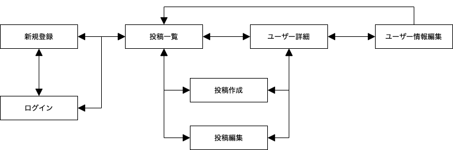

# effornal (エフォーナル)
effort(努力) ＋ eternal(永遠の) → effornal  
URL: https://effornal.herokuapp.com/

# アプリ概要
### 勉強した科目と時間を**記録**＆**投稿**できるアプリです！
- 自分が何をどれくらい頑張ったのか、他の人が何を頑張っているのかを見ることできます。
- 各ユーザーの「合計勉強時間」や「各科目の勉強時間」というデータを確認できます。
- 頑張っている人には、「**いいね**」して応援できます。(反対に応援されることも！)

| 投稿一覧ページ |
| --- |
|  |

| ユーザー詳細ページ |
| --- |
|  |

# コンセプト
- 自分の頑張りを可視化して、**モチベーション**を上げよう！
- 誰かの頑張りを可視化して、**良い刺激**を受けよう！

# テストアカウント
### メールアドレス  
test@user.com  

### パスワード  
test0user

# 作成期間
- 2021/1/14 Laravel学習開始
- 2021/1/20 effornal(本アプリ)開発開始
- 2021/1/26 完成、デプロイ完了

# 使用言語技術
### バックエンド
- PHP 7.3.11
- Laravel Framework 6.20.14
### フロント
- HTML
- CSS
- SCSS
- JavaScript
- jQuery
- Bootstrap 4
### データベース
- MySQL
### API
- Google+ API
### インフラ
- Heroku

# 画面遷移図

# データベース設計

# 機能一覧
## ユーザー関連
- ユーザー登録、ログイン、ログアウト
- Googleアカウントを利用したログイン
- ユーザーアイコン(ユーザー新規登録者は用意してあるデフォルト画像、Googleログイン者はGoogleアカウントの画像がアイコンになる)
- ユーザー情報編集(名前とアイコン画像を変更可能)
## 投稿関連
- 投稿作成・編集(科目名が空or勉強時間が0分or詳細が空、だと作成不可)
- 科目名の入力時、投稿データに存在している科目名は自動補完される
- 投稿削除
- 投稿編集・削除によって、科目名が投稿データに存在しなくなる場合、その科目名のデータは削除され、自動補完として表示されなくなる
- 投稿したデータを元に、各ユーザーの「合計勉強時間」と「各科目の勉強時間」を表示
- ログイン中であれば「いいね」できる
## その他
- フラッシュメッセージを表示(ユーザー登録、ログイン、ログアウト、ユーザー情報更新、投稿作成、投稿編集、投稿削除)
- エラーメッセージを日本語化
- レスポンシブデザイン

# 今後実装したい機能
- 各投稿に対してのコメント機能
- フォロー機能
- DM機能
- 通知機能
- 各科目ごとの勉強時間ランキング機能

# URL
https://effornal.herokuapp.com/