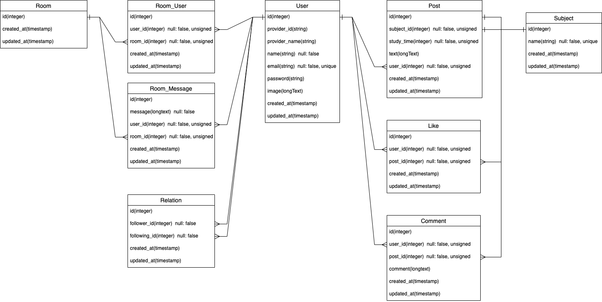

# effornal (エフォーナル) 
URL: http://effornal.com

## アプリ概要
このアプリのコンセプトは、以下の2点です。
- 自分の頑張りを可視化し、**モチベーション**を上げる。
- 誰かの頑張りが可視化され、**良い刺激**を受ける。

永遠(eternal)に努力(effort)するために利用するアプリなので、  
**「effornal」** というアプリ名にしました。

このアプリには以下のような特徴があります。
- 勉強した科目、時間、内容(アウトプットなど)を投稿できる。
- 自分、もしくは他のユーザーが何の科目をどのくらい勉強しているか確認できる。
- 合計勉強時間のランキング機能。
- 以下のそれぞれの投稿データに対して検索をかけることができる。
  - 全投稿
  - 対象ユーザーの投稿
  - 自分がいいねした投稿
- フレンドになったユーザーとダイレクトメッセージができる。

## 開発した背景
自分が毎日のようにプログラミングを勉強していて、  
- 自分はどれくらいの時間頑張ってきたか知りたい。  
- 他の人はどのくらい勉強していて、何をどのように勉強しているか知りたい。
- 自分のアウトプットや他の人が発信した有益な情報をすぐに見れるようにしておきたい。

と感じ、それができるアプリが欲しいなと思ったことがきっかけです。  

Twitterを利用し、勉強したことをアウトプットしてきた中で、 
- 勉強に関する情報を発信したり、されたりしても、他の情報に埋もれてしまって発見しづらい。
- '自分の投稿'や'いいねした投稿'の中から、もう1度見たい投稿を検索して表示させたいけどできない。

という経験をしました。  

こうした経験から、勉強に関する情報に特化したアプリを作りたいと考えたことが背景にあります。

## 使用画面のイメージ

| 投稿一覧ページ | 投稿作成ページ |
| --- | --- |
|  |  |

| 投稿詳細ページ | ユーザー詳細ページ |
| --- | --- |
|  |  |

| プロフィール編集ページ | ランキングページ |
| --- | --- |
|  |  |

| フレンドページ | DMページ |
| --- | --- |
|  |  |

## テストアカウント
### メールアドレス  
test@user.com  

### パスワード  
test0user

## 使用言語技術
### バックエンド
- PHP 7.4.14
- Laravel Framework 6.20.16
<!-- - PHPUnit 7.5.20 -->
### フロント
- HTML
- CSS
- SCSS
- JavaScript
- jQuery
- Bootstrap 4
### データベース
- MySQL 5.7.33
### API
- Google+ API
### インフラ
- CircleCi
- Docker 20.10.2 / docker-compose 1.27.4
- nginx 1.18.0
- AWS（EC2, RDS, CloudFormation, Route53, EIP, IAM）

## 機能一覧
### ユーザー関連機能
- 新規登録、プロフィール編集。
- ログイン、ログアウト。
### GoogleAPI連携
- Googleアカウントを利用したログイン。
### 投稿関連機能
- 投稿作成・編集・削除。
- 科目名の入力時、入力文字が含まれた科目名を自動補完する。
### 投稿表示関連機能
- 全ユーザーの投稿を表示。
- 対象ユーザーの投稿のみを表示。
- 自分が"いいね"した投稿のみを表示。
### 投稿検索機能
- ↑のそれぞれ投稿データに対して検索できる。
- 例：自分が"いいね"した投稿のみが表示されている画面で検索すると、そのデータ内から投稿を検索する。
### いいね関連機能
- 投稿に"いいね"できる。
- 投稿毎に"いいね"したユーザー一覧を表示できる。
### コメント機能
- 投稿毎にコメントできる。
### 勉強時間表示機能
- 各ユーザーの「総科目の合計勉強時間」と「各科目の合計勉強時間」を表示。
### フレンド関連機能
- フレンド申請、承認。
- フレンド一覧を表示。
- フレンド申請中のユーザー一覧を表示。
- フレンド承認待ちのユーザー一覧を表示。
- ユーザーを名前で部分検索できる。
### ダイレクトメッセージ機能
- フレンドとのみダイレクトメッセージができる。
- 非同期通信でメッセージのやり取りができる。
### 合計勉強時間ランキング機能
### フラッシュメッセージ表示機能
### レスポンシブデザイン

## データベース設計

## 各テーブルについて
| テーブル名 | 説明 |
| --- | --- |
| User | 登録ユーザー情報 |
| Post | 投稿情報 |
| Subject | 投稿の科目名情報 |
| Like | 投稿への"いいね"情報 |
| Comment | 投稿へのコメント情報 |
| Relation | フレンド関連のユーザー情報 |
| Room | DM用ルームの情報 |
| Room_User | DM用ルームに該当するユーザー情報 |
| Room_Message | DM用ルームに該当するメッセージ情報 |

## 今後実装したい機能
- 通知機能
- 各科目ごとの勉強時間ランキング
- 1番勉強されている科目ランキング

## URL
http://effornal.com